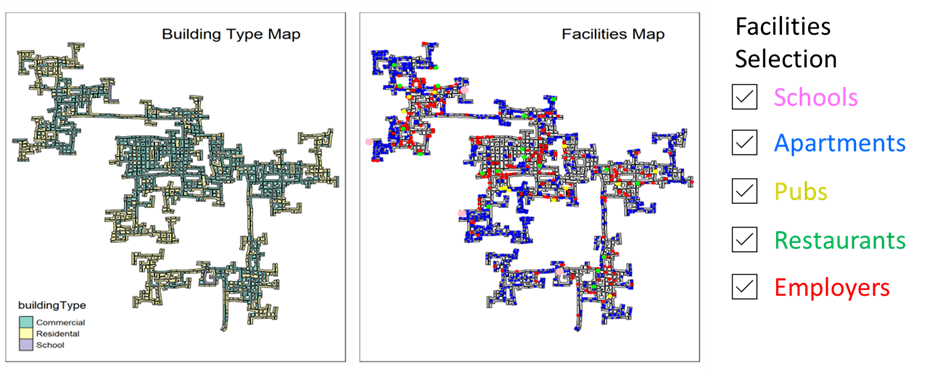
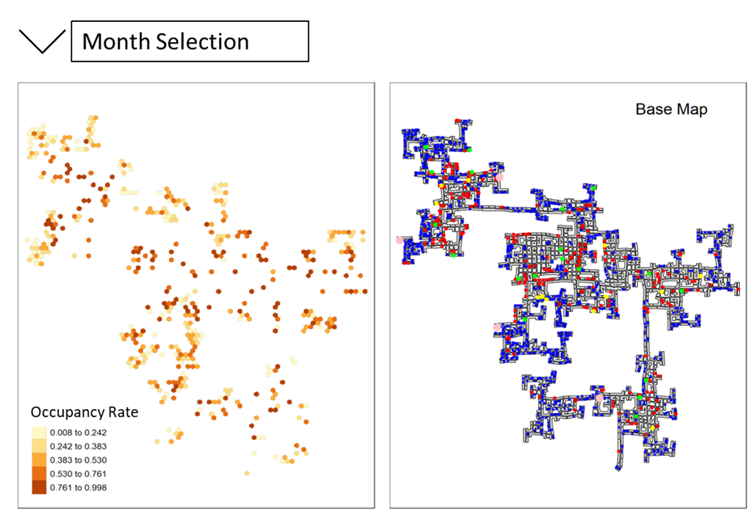
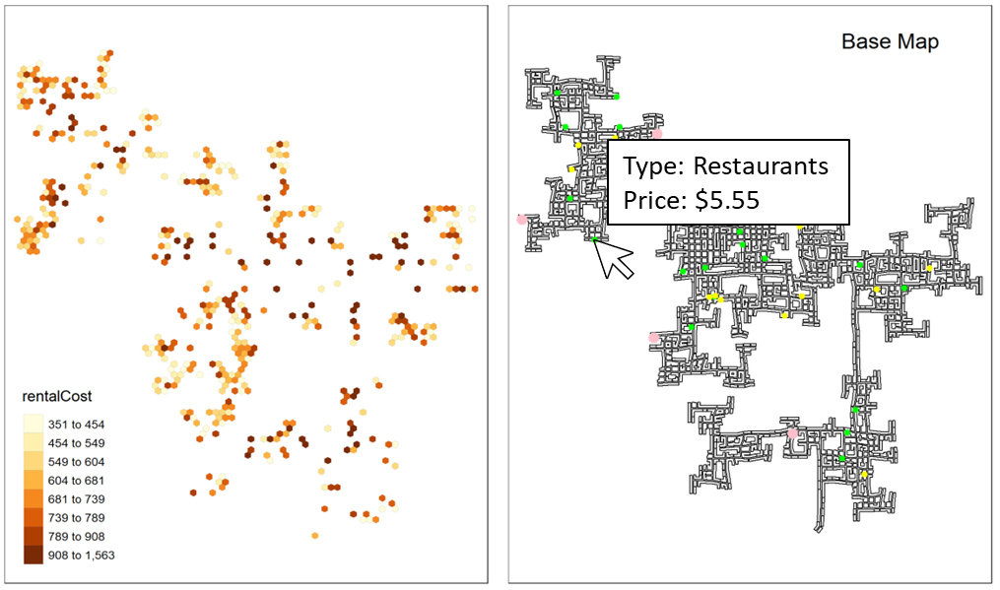
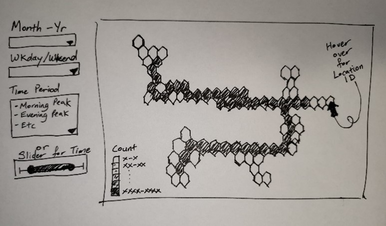

```{r setup, include=FALSE}
knitr::opts_chunk$set(echo = TRUE,
                      eval = TRUE,
                      message = FALSE,
                      warning = FALSE,
                      fig.retina = 3)
```

## 1. Project Overview

This project will be based on [**VAST Challenge 2022**](https://vast-challenge.github.io/2022/). The city of Engagement, Ohio USA is anticipating future rapid growth by doing a participatory urban planning survey. A total of 1011 representative residents have agreed to provide their data using the urban planning app, such as the places they visit and their financial journal.

Out of 3 challenges in VAST Challenge 2022, we decided to select **Challenge 2: Patterns of Life**. In this challenge, we will reveal the patterns of daily life throughout the city. Specifically, we will characterize the distinct areas within the city, identify the potential traffic bottlenecks, describe the daily routines for selected participants and examine how patterns change over time.

## 2. Data Source

Datasets were obtained from the VAST Challenge 2022 official website in csv format. Datasets required for this challenge are including, but not limited to:

- ParticipantStatusLogs(n).csv
- Buildings.csv
- Participants.csv
- Pubs.csv
- Restaurants.csv
- CheckinJournal.csv

Data processing will be further explained in the next section below.

## 3. Methodology

The following are the packages required for this challenge, including but not limited to:

-	**tidyverse**: to support data science including data manipulation and static statistical graphs creation  
-	**sf**: to handle geospatial data in wkt format
-	**tmap**: to visualize movement data
-	**lubridate**: to manipulate date-time object
-	**clock**: to manipulate date-time object
-	**ViSiElse**: to visualize daily routines
-	**gganimate**: to create animated statistical graphs for time-series analysis 
-	**ggstatsplot**: to provide statistical details


## 4. Proposed Visualization

### 4.1 City Area Characterization

### Problem Statement

Assuming the volunteers are representative of the city’s population, characterize the distinct areas of the city that you identify. For each area you identify, provide your rationale and supporting data. Limit your response to 10 images and 500 words.

### Visualization 1: Building Composite Map for Facilities Location

#### Intent and Implementation

The intent of this visualization is to show the outline of the different buildings as well as the location of different facilities (Apartments, Pubs, Restaurants, Schools, and Employers). The different facility types will be depicted by different colour dots. As for the base building outlines, it will be depicted by two colours based on the building type (either commercial or residential). To ensure ease of use, and to prevent the visualization from being too cluttered, check boxes will be used to allow for the selection of facility types to be shown.

#### Data Processing

The Apartment, Pubs, Restaurant, Schools, and Employer data files are to be merged into a single file with only the facility type and building number retained. This will aid in the minimizing of the data file size.

#### Example of Visualization



#### Anticipated Problems and Areas for Improvements

Visualization may be too cluttered to bring sufficient insights and value. As there are many employer locations, including them may fail to yield good insights. This can be reconsidered after testing out the visualization. 

### Visualization 2: Building Composite Map for Participants – Filtered by Demographic Parameters

#### Intent and Implementation

The intent of this visualization is to study how the demographic attributes of the participants affect the location that they reside at. To enable this a building composite map visualization will be built with the demographic attributes present as filters on the R Shiny application. To allow for comparison, two sets of filters will be show, with the output of the first filter being shown by blue dots and the second filter being shown by red dots. Filters used will be:

- Household Size (Drop down list)
- Number of Kids (Drop down list)
-	Education Level (Drop down list)
-	Interest Group (Drop down list)
-	Age (Scroll bar with start and end selection)
-	Joviality (Scroll bar with start and end selection)

#### Data Processing

The participants apartment Id will have to be extracted from the ParticipantsLog dataset. The corresponding dataset is then merged with the Participants dataset and Apartment dataset to get a final dataset with all the participant demographic data and their corresponding building Id.

#### Example of Visualization


#### Anticipated Problems and Areas for Improvements

At this juncture it is not clear if a having both plots on a single graph would be best option. Alternatively, we could explore having two plots with their own filters. 

### Visualization 3: Hexagonal Binning Map for Residential Occupancy Rate

#### Intent and Implementation

The intent of this visualization is to show if certain areas of the city is more desirable to the participants over other areas. This will be done by using the computed occupancy rate of buildings as the event points in the hexagons. Occupancy rate can be calculated for different months of the observation period to see if there are any noticeable changes in area occupancy rate over time.

#### Data Processing

A snapshot of the participants apartment Id will be taken for the start of every month from the ParticipantStatusLogs. The apartment Id will then be matched with the corresponding building Id using the Apartments dataset. The Apartment dataset will also be used to compute the max occupancy limit for apartments in each building. The total count of participants residing in a building divided by the max residential occupancy of the building will give us the residential occupancy rate of the building.

#### Example of Visualization



#### Anticipated Problems and Areas for Improvements

A possible area for improvement could be to animate the changes in occupancy rate over the different months to showcase the difference. 

### Visualization 4: Hexagonal Binning Map for Cost of Rental and Facilities

#### Intent and Implementation

This visualization aims to show how cost of rental and other facilities differ across the city. The visualization on the left will use the average rental cost per occupant per building as the event points for a hexagonal diagram. The second visualization on the right will show the facilities on a base map with their associated costs as the tooltip (e.g. For Restaurants, foodCost will be used).

#### Data Processing

Firstly, the additional data that is not required all the datasets (Apartments, Schools, Restaurants and Pubs) will be dropped to reduce file size. Following this, the average cost associated with each building will be computed using group by function. The Apartment dataset will be used to compute the average per occupant rental cost for each building.

#### Example of Visualization



#### Anticipated Problems and Areas for Improvements

We could consider linking up both visualization such that hovering over one hex would highlight the same hex in the second visualization (by fading out the other hexes in the plot)

### 4.2 Traffic Bottlenecks

### Problem Statement

Where are the busiest areas in Engagement? Are there traffic bottlenecks that should be addressed? Explain your rationale. Limit your response to 10 images and 500 words.

### Visualization 1: Histogram for Participants’ Count in Locations over Time 

#### Intent and Implementation

The intent of this visualization is to find out peak periods of high traffic at various locations in the city by counting the footfall of participants at various participants across the day in the form of histogram. Additional segregation to be done to visualize the difference between weekdays and weekends.
With a dropdown box for Location selection, a main histogram of the traffic density across the 24 hours will be charted, along with the desired Month to be selected via another dropdown box. Another set of charts (facets of weekdays and weekends) that are linked to the same Location and Month selection, would also be plotted to allow visualization of the traffic histogram across the days of the week.

#### Data Processing

To optimize memory load, only the participants’ location data will be extracted (hourly snapshot) from the multiple ParticpantsStatusLog (72 of them) data files and merged into a single file.

#### Example of Visualization


#### Anticipated Problems and Areas for Improvements

The amount of data is expected to be huge even with selective extraction/cleaning at the start. We will optimize again if it becomes too cumbersome to produce the charts.
We are expecting to see certain peak hours across the weekdays and weekends, from there we will be able to narrow down these key interest time periods for our subsequent analysis in this traffic bottleneck problem.
To reduce the number of locations, we could bin the locations into different areas/segments of the city. A map could be used to show the user the different location bins. Alternatively, we could use user selection to generate an interactive data table from which the histogram is shown.

### Visualization 2: Hexagon Binning Map for Traffic Density over Time 

#### Intent and Implementation

The intent of this is to visualization is to plot the traffic density heatmap of the various locations in the city via hexagon mapping, with toggles on the Time (binned), Month and Weekday/Weekend to showcase the difference in the traffic bottlenecks.
With a dropdown box for Location selection, a main histogram of the traffic density across the 24 hours will be charted, along with the desired Month to be selected via another dropdown box. Another set of charts (facets of weekdays and weekends) that are linked to the same Location and Month selection, would also be plotted to allow visualization of the traffic histogram across the days of the week.

#### Data Processing

The participants’ location data will be extracted (hourly snapshot) from the multiple ParticpantsStatusLog (72 of them) data files and merged into a single file. The dataset will then be binned into certain time periods to optimize memory load for charting. Having said that, we may try to allow for timing selection (slider) to alter the hexagon mapping chart accordingly.

#### Example of Visualization



#### Anticipated Problems and Areas for Improvements

The amount of data is expected to be huge even with selective extraction/cleaning at the start. We will optimize again if it becomes too cumbersome to produce the charts.
We are expecting to see certain peak hours across the weekdays and weekends, from there we will be able to narrow down these key interest time periods for our subsequent analysis in this traffic bottleneck problem.

### 4.3 Daily Routines of Participants

### Problem Statement

Participants have given permission to have their daily routines captured. Choose two different participants with different routines and describe their daily patterns, with supporting evidence. Limit your response to 10 images and 500 words.

### Visualization 1: Daily Routine by ViSiElse

#### Intent and Implementation

This visualization will show daily activities of two selected participants. Using demographic variables, day, and month filtering options, this will tell the audience how their weekdays and weekends routines vary across different months. For example, we will compare Sunday activities of the happiest participant against the unhappiest participant in December 2022.

#### Data Processing

We will be using a new joined dataset derived from 72 ParticipantsStatusLog datasets for daily activities. Using demographic variables such as joviality, we will select two participants that are at the extreme ends. Next, we will filter these two participant IDs and save it as a new dataset.

#### Example of Visualization


#### Anticipated Problems and Areas for Improvements

Data preparation to fit ViSiElse requirement and data exploration to select two distinct participants. Further study is to check if we are able to make ViSiElse visualization interactive, which possibly leads to other visualization. 

